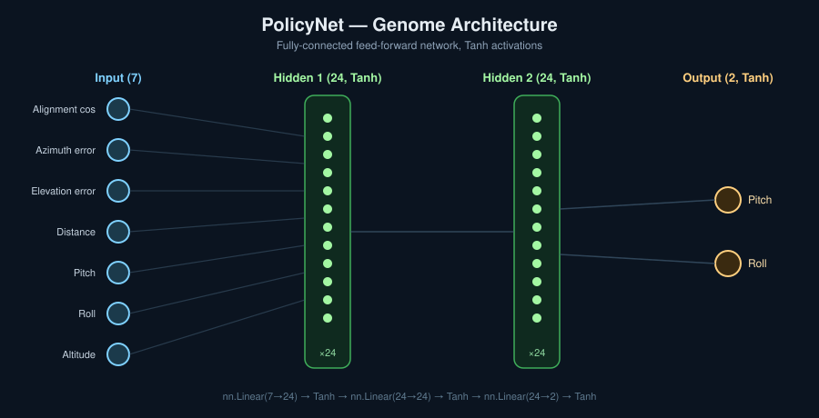

This is a Genetic Algorithm project!

This project uses a genetic algorithm to teach pilot bots how to intercept waypoints.
In a flight simulator environment we initialize one-hundred bots.
Each bot is represented by a set of weights over a fully connected feed forward neural network.
The FFN gets the next inputs:
1. Alignment cosine (angle between heading and target direction)
2. Azimuth error (horizontal steering error)
3. Elevation error (vertical steering error)
4. Distance to target waypoint
5. Current pitch
6. Current roll
7. Current altitude

And outputs the next flying orders:
1. Pitch
2. Roll

The form of the NN:

7 inputs → Linear(7→24) + Tanh → Linear(24→24) + Tanh → Linear(24→2) + Tanh → 2 outputs

We run the simulation and choose the best bots out of the candidates.
Then we multiply the best and make minor changes to create the **evolution effect**.
After a few dosens of generations there is a visible improvement.
